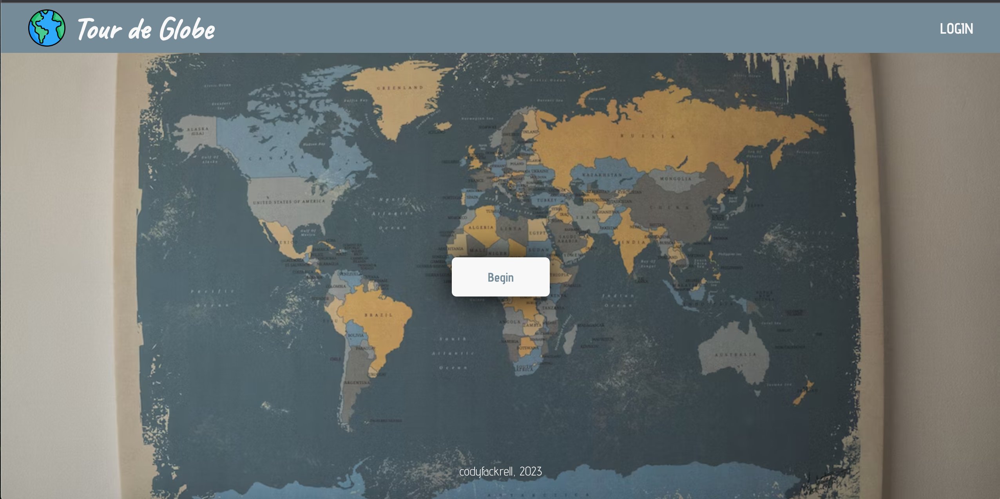
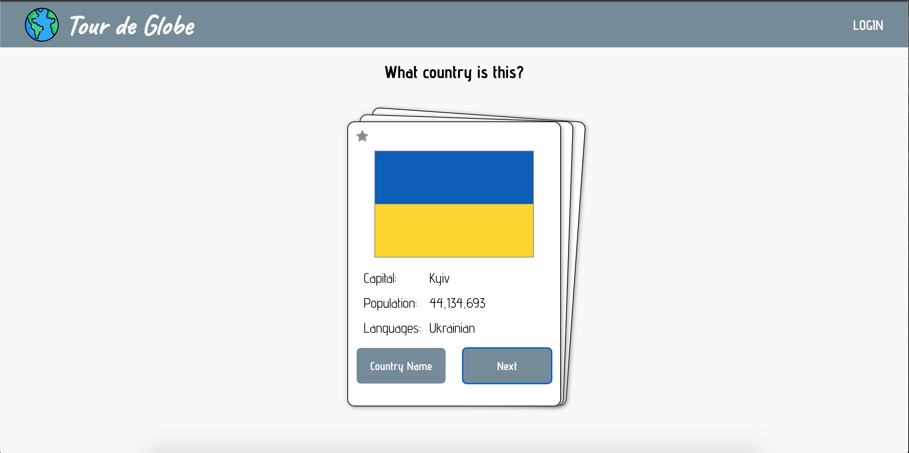
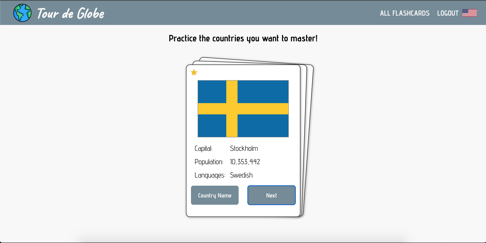
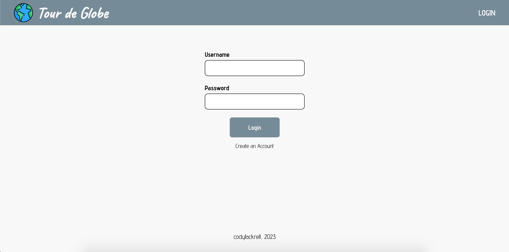
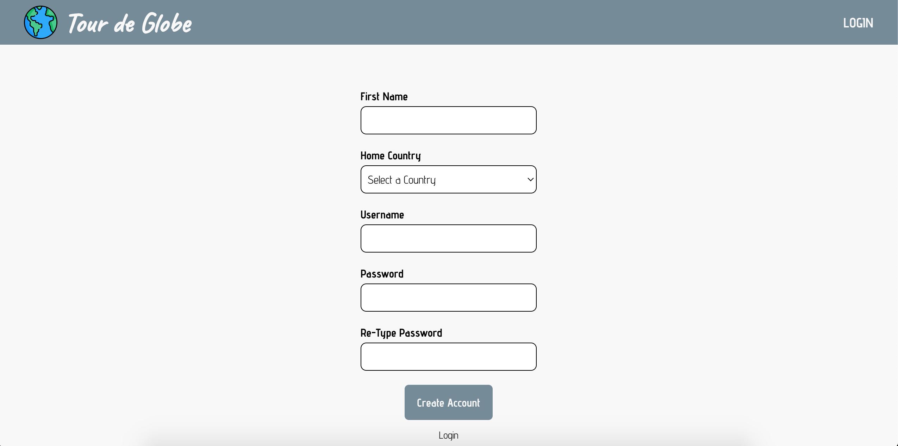

# *Tour de Globe: A Country Flashcard App*

*Tour de Globe* is a React web application to help you learn the capitals and flags of countries around the world in a fun and interactive way. 

[Watch the demo](https://www.loom.com/share/407a2b8fbcab4713a93d3a2ba11fac7f?sid=6e096e36-0125-4fac-8605-ebc3573edf00)
 
[Learn more about the developer](https://www.linkedin.com/in/codyfackrell/)

Tech Stack:
* React
* Node.js
* Express
* PostgreSQL
* Sequelize

 

***Home Page View:***
 

 

***All Country Flashcards:***
 

 

***Saved Country Flashcards:***
 

 

***Login Page:***
 

 

***Register Page:***
 

 

***Flashcard Animation:***

https://github.com/codyfackrell/countryFlashcards/assets/115325371/1fedf04b-3e44-4e05-94b4-10b1b6b4a974

